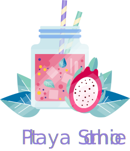

  

<table width='100%' align="center">
    <tr>
        <td align='left' width='100%' colspan='2'>
            <strong><code>🦄 Pitaya Smoothie </code></strong> 
            A professional theme with hand-picked & bold colours for your VS Code editor and terminal. The theme is heavily inspired by the <a href="https://www.pantone.com/color-intelligence/color-of-the-year/color-of-the-year-2018">Pantone colour of the year 2018</a> and the Outrun aesthetics.
            However, colours are on the pastel side to help provide contrast and highlight what is important.
            Color choices have taken into consideration what is accessible to people with colorblindness and in low-light circumstances.
        </td>
    </tr>
    <tr>
        <td>
            A FOSS (Free & Open Source Software) project developed by <a href='https://github.com/trallard'  target="_blank">Tania Allard</a>.
        </td>
        <td align='center'>
            
        </td>
    </tr>
    <tr><td> Follow Tania's #FOSS work on GitHub <a href='https://github.com/trallard'>@trallard</a> —   Say Hi on Twitter <a href="https://twitter.com/ixek/">@ixek</a></td><td  align='center'> <a  target="_blank" href='https://bitsandchips.me/'>👋 </a></td></tr>
</table>

## Installation

1. Install [Visual Studio Code](https://code.visualstudio.com/)
1. Open the extensions sidebar on Visual Studio Code
2. Search for `Pitaya Smoothie`
3. Click **Install** to install it.
4. Click **Reload** to reload your editor.
5. Code/File ＞ Preferences ＞ Color Theme ＞ **Pitaya Smoothie**

## Pitaya Smoothie syntax Colours
This theme is heavily inspired by the Outrun aesthetics. The color choices for the theme were made also taking into consideration accessibility for those users with colorblindness.
The theme consists of a fairly dark bakcground and poppping contrast colours. 
Decisions were also based on meaningful contrast for reading comprehension and for optimal colour popping :sparkles:.

| USAGE                              | HEX CODES                                                              |
| ---------------------------------- | ---------------------------------------------------------------------- |
| Background                         |  `#181036`   |
| Foreground                         |  `#FEFEFF`   |
| Cursor                             |  `#f85e9f`   |
| Comment  italic                    |  `#B4ADCA`   |
| String                             |  `#66E9EC`   |
| Number                             |  `#F28D52`   |
| Built-in const                     |  `#CAF884`   |
| Constant                           |  `#A267F5`   |
| Variable italic                    |  `#F7F7F7`   |
| Keyword                            |  `#F26196`   |
| Storage                            |  `#F26196`   |
| Storage type                       |  `#A56CF5`   |
| Class italic                       |  `#7998F2`   |
| In herited Class italic underlined |  `#FFE46B`   |
| Function                           |  `#66E9EC`   |
| Function argument italic           |  `#ffffff` |
| Tag name                           |  `#EF4A86`   |
| Tag attribute                      |  `#66E9EC`   |
| Lib function                       |  `#EF4A86`   |
| Lib constant                       |  `#7998F2`   |
| Lib class  italic                  |  `#FFE46B`   |
| Invalid                            |  `#FD1D53`   |
| Json string                        |  `#FF6E9C`   |
| Diff deleted                       |  `#FF6E9C`   |
| Diff inserted                      |  `#45F5CF`   |
| Diff changed                       |  `#FFE46B`   |
| Punctuation                        |  `#C4A2F5`   |

## UI elements colours 

| UI ELEMENT                         | HEX CODES                                                            |
| ---------------------------------- | -------------------------------------------------------------------- |
| Activity bar background            |  `#181036` |
| Activity bar foreground            |  `#7A76C2` |
| Activity bar badge background      |  `#18c0c4` |
| Activity bar foreground            |  `#181036` |
| Activity bar foreground            |  `#181036` |
| Sidebar background                 |  `#130C29` |
| Sidebar  section header background |  `#181036` |
| Sidebar  section header foreground |  `#7d79d1` |

## License and Attribution

**Licensed** as BSD-3 ⓒ [Tania Allard](https://bitsandchips.me/).

